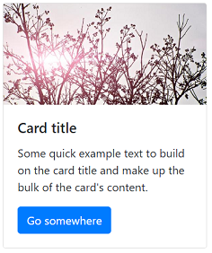
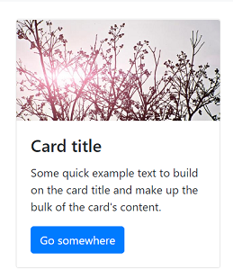
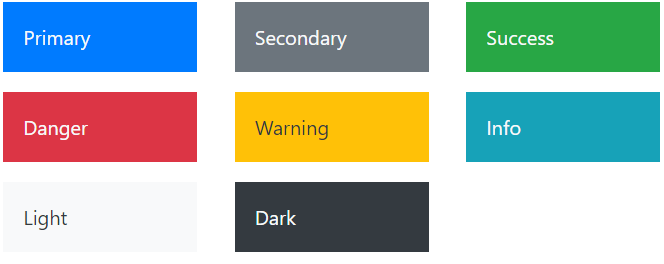

# Getting started and using BootstrapVue
+ By: Joshua Grosserhode

## First, what is Bootstrap
Bootstrap is one, if not the most popular, CSS frameworks. It is designed around being mobile friendly and responsive to screen changes. For example, a website using Bootstrap's container/grid system will render and shift content to accomodate the user's device. It will also dynamically change size & layout if the viewport changes.

Another facete of Bootstrap is its component library. [Components](https://getbootstrap.com/docs/4.4/components) include items such as: 
* decorative buttons
* cards
* carousels
* navbars

Bootstrap components are invoked by assigning the bootstrap component's class to the appropriate html element.
Here is an example of invoking the card component:
```html
<div class="card" style="width: 18rem;">
  
  <div class="card-body">
    <h5 class="card-title">Card title</h5>
    <p class="card-text">Some quick example text to build on the card title and make up the bulk of the card's content.</p>
    <a href="#" class="btn btn-primary">Go somewhere</a>
  </div>
</div>
```
Which renders this:

*Src: https://getbootstrap.com/docs/4.4/components/card*

So, in short, Bootstrap does a lot of the CSS work for you. There are limitations and if you need something really specific, you will probably still have to make it yourself.

## How is Bootstrap different from BootstrapVue and which should be used when making an application with Vue.js?
There are two distinct parts of Bootstrap, the CSS and the logic. Many of the Bootstrap components only use CSS and some use both CSS and jQuery. jQuery is the logic that provides added functionality. With that said, it appears that Bootstrap v5 will be [dropping jQuery](https://mdbootstrap.com/bootstrap-5/) as a dependency and using vanilla JaveScript in its place.
BootstrapVue on the otherhand does not use any jQuery for the logic side, it instead is written in Vue! This was done so that the BootstrapVue components will continue to be dynamic and controlled by the Vue framework.

The BootStrapVue components are Vue single file components (SFCs) and are always prefixed with `b-` for example `<b-button />` would be a button component, which looks like this in Bootstrap `<a class="btn" />`. Because these are SFCs, they can be treated as such, allowing props to be passed, along with everything else we would expect from our components.
To illustrate the difference between Bootstrap and BootstrapVue, below is the same card being rendered, but this time using a BootstrapVue component:

```html
  <b-card
    title="Card title"
    img-src="https://picsum.photos/600/300/?image=25"
    img-alt="Image"
    img-top
    tag="article"
    style="max-width: 18rem;"
    class="mb-2"
  >
    <b-card-text>
      Some quick example text to build on the card title and make up the bulk of the card's content.
    </b-card-text>

    <b-button href="#" variant="primary">Go somewhere</b-button>
  </b-card>
  ```
Which renders this:

*Src: https://bootstrap-vue.org/docs/components/card*

## Getting Started with BootstrapVue without Build (using CDN)
To incorporate BootstrapVue into your project without using a build system, first, simply include the following `<link>`s and `<script>`s in the ` <head></head> ` section of your html page
```html 
<head>
    <!-- Required Stylesheets -->
    <link
      type="text/css"
      rel="stylesheet"
      href="https://unpkg.com/bootstrap/dist/css/bootstrap.min.css"
    />
    <link
      type="text/css"
      rel="stylesheet"
      href="https://unpkg.com/bootstrap-vue@latest/dist/bootstrap-vue.css"
    />

    <!-- Required scripts -->
    <script src="https://unpkg.com/vue@latest/dist/vue.js"></script>
    <script src="https://unpkg.com/bootstrap-vue@latest/dist/bootstrap-vue.js"></script>
</head>
```
**Src:** *https://bootstrap-vue.org//docs/reference/starter-templates*

## Getting Started with BootstrapVue with Build

Assuming you are already in the project folder built using Vue CLI. Install BootstrapVue & Bootstrap using the following:
```
# With npm
npm install vue bootstrap-vue bootstrap
```
Then import it into your app
```js
import Vue from 'vue'
import BootstrapVue from 'bootstrap-vue'

// Install BootstrapVue
Vue.use(BootstrapVue)
```
And lastly import the BootstrapVue css files into your main.js file
```js
import 'bootstrap/dist/css/bootstrap.css'
import 'bootstrap-vue/dist/bootstrap-vue.css'
```
As an alternative to the last step, BootstrapVue can be imported into a custom .scss, similar to the one in the zip-foods demo, and included in your Vue project that way.
```js
@import 'node_modules/bootstrap/scss/bootstrap';
@import 'node_modules/bootstrap-vue/src/index.scss';
```
**Src:** *https://bootstrap-vue.org/docs#using-module-bundlers*


## Color Variants and Custom Themes
BootstrapVue uses the same defualt color theme as Bootstrap. These defualt color variants can be overridden in a custom .scss file (if that is where you imported the BootStrapVue.scss).

The default color variants look like this:


These defaults can be overwritten in your custom .scss file like this (This will turn the `primary` variant from the default blue to bright green):
```scss
$primary: #09bd33;
```
A list of default scss variables can be found [here](https://bootstrap-vue.org/docs/reference/color-variants)

**Src:** *https://bootstrap-vue.org/docs/reference/theming*

## Closing Comments
BootstrapVue is so great..

### Playground and live scripts
BootStrapVue has a [playground](https://bootstrap-vue.org/play) to get started, and all of the examples in the (docs)[https://bootstrap-vue.org/docs/components/alert] are live/editable! Simply double-click any code block in the docs section and it becomes a "live" script.

### Icons
BootstrapVue also offers [537 icons](https://bootstrap-vue.org/docs/icons).
They are called just like components, to add an icon of a book, simply add this element `<b-icon-book />` or `<b-icon icon="book" /> (this section option makes it easier to dynamically control the icon). Before using icons, they must be imported into the projects main.js file:
```js
import IconsPlugin from 'bootstrap-vue'
Vue.use(IconsPlugin)
```

### Third Party Resources
A [list](https://bootstrap-vue.org/docs/reference/third-party) of useful (but non-endorsed) 3rd party components and libraries. Some interesting ones include:
* elegent date picker
* charting libraries that offer powerful charting of responsive Vue data
* form validators that check the user's input and provide feedback dynamically


### BootstrapVue Alternative
Another Bootstrap + Vue project is [VueStrap](http://yuche.github.io/vue-strap/). VueStrap is not as mature as BootStrapVue is at this point, but may be a good alternative to consider in the near future.

## Sources
* https://getbootstrap.com/
* https://stackoverflow.com/questions/50127800/comparison-between-bootstrap-vue-and-bootstrap-4
* https://bootstrap-vue.org/
* https://github.com/bootstrap-vue/bootstrap-vue
* https://blog.logrocket.com/getting-started-with-bootstrapvue-2d8bf907ef11/
* http://yuche.github.io/vue-strap/
* https://www.sitepoint.com/bootstrap-vue-js-bootstrap-vue/